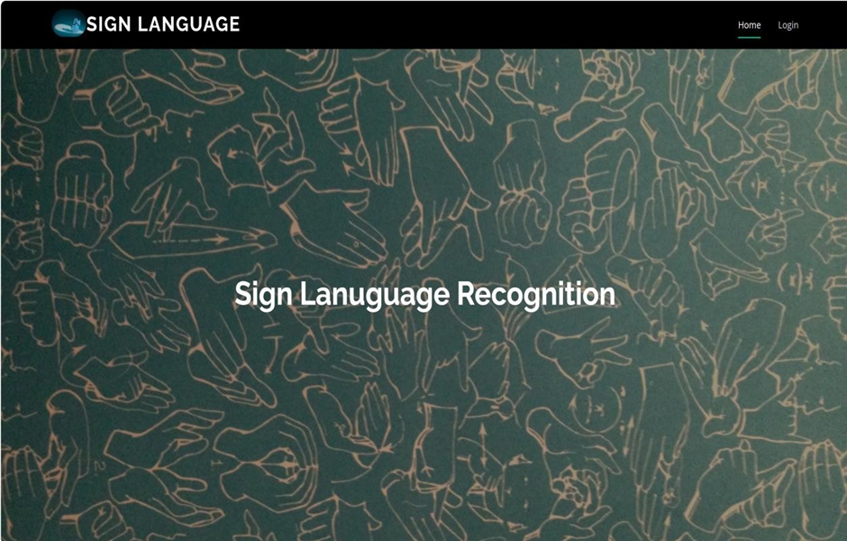
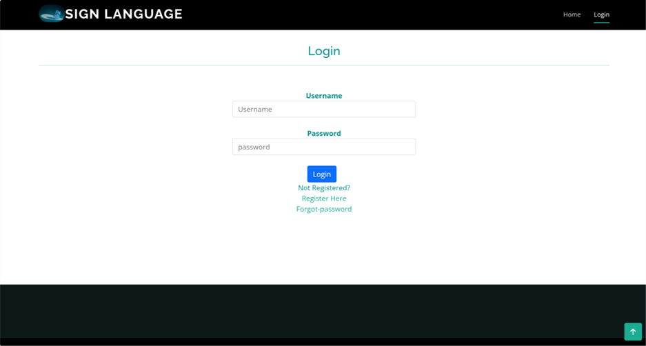
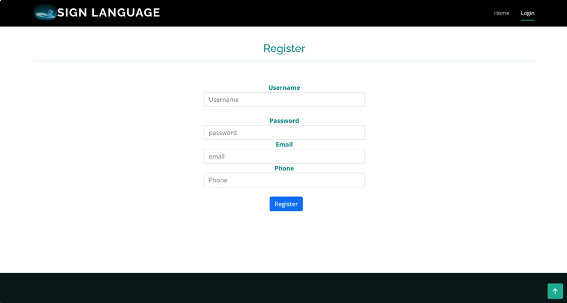
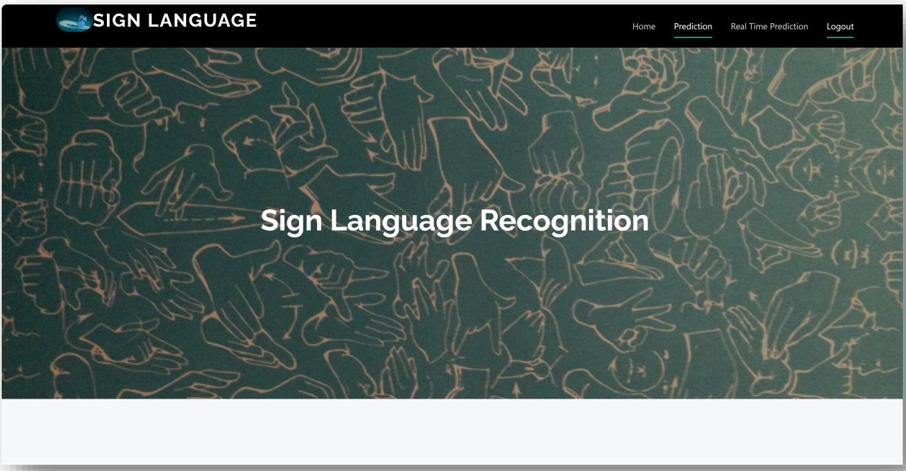

# 🤟 Real-Time Sign Language Recognition Using YOLOv5

## 📌 Project Overview
Sign Language Recognition System that uses **YOLOv5** and **Computer Vision** to detect and recognize hand gestures in real time through a webcam. The system helps bridge the communication gap between hearing-impaired individuals and others by translating sign language gestures into understandable outputs.

The project was developed as part of an academic and practical machine learning initiative, focusing on object detection, deep learning, and human-computer interaction.

---

## 🎯 Objectives
- Detect sign language gestures in real time.
- Improve communication accessibility for hearing-impaired individuals.
- Apply deep learning-based object detection using YOLOv5.
- Demonstrate practical implementation of AI in assistive technologies.
- Build a scalable framework that can be extended to larger sign language vocabularies.

---

## 🚀 Key Features
- Real-time sign language detection using webcam input.
- YOLOv5-based object detection model.
- Custom-trained dataset for sign recognition.
- Fast and accurate predictions.
- Easy-to-use execution workflow.
- Extensible architecture for adding new gestures.

---

## 🛠️ Technologies Used

### Programming Language
- Python

### AI / Machine Learning
- YOLOv5
- PyTorch
- OpenCV

### Development Tools
- Jupyter Notebook
- LabelImg Annotation Tool
- Git & GitHub

---

## 📂 Project Structure

Real-Time-Sign-Language-Recognition/
│
├── README.md
├── capture_image.py
├── run.py
├── Sign_language_Generation_Using_YOLO_v5.ipynb
│
├── Output Images/
│   ├── dataset_collection.png
│   ├── annotation_process.png
│   ├── training_results.png
│   ├── detection_output_1.png
│   ├── detection_output_2.png
│   └── confusion_matrix.png
│
├── yolov5/
│   ├── best.pt
│   ├── detect.py
│   └── ...
│
└── Annotation Tool/

## 🔄 Project Workflow

### 1. Data Collection
Images of different sign language gestures are captured using the webcam through `capture_image.py`.

Current gesture classes:
- Hello
- Yes
- No
- Thanks
- I Love You
- Please

### 2. Data Annotation
Collected images are annotated using the LabelImg tool to generate bounding box labels required for training.

### 3. Model Training
The annotated dataset is used to train a custom YOLOv5 model capable of detecting sign language gestures.

### 4. Real-Time Detection
The trained model (`best.pt`) is loaded and executed using:

```python
python detect.py --weights best.pt --img 416 --conf 0.5 --source 0
```

The webcam feed is analyzed in real time and detected signs are displayed instantly.

---
## 📸 Project Outputs

### Annotation Process



### Login Page 



### Sign Up page


### Forgot Password Page


### Real-Time Detection


### Live Gesture Recognition


### Log out Page


## 🧠 Machine Learning Approach

### Model
YOLOv5 (You Only Look Once Version 5)

### Why YOLOv5?
- High detection speed
- Excellent real-time performance
- Strong accuracy for object detection tasks
- Suitable for deployment on standard hardware

### Detection Pipeline
1. Webcam captures frames.
2. Frames are preprocessed.
3. YOLOv5 performs inference.
4. Bounding boxes and gesture labels are generated.
5. Results are displayed in real time.

---

## 📈 Expected Outcomes
- Accurate recognition of predefined sign language gestures.
- Reduced communication barriers.
- Demonstration of AI-assisted accessibility solutions.
- Foundation for future sign-to-text and sign-to-speech systems.

---

## 🔮 Future Enhancements
- Expand the gesture vocabulary.
- Convert detected signs into complete sentences.
- Integrate Text-to-Speech functionality.
- Deploy as a web application.
- Mobile application integration.
- Support for Indian Sign Language (ISL) and other sign systems.
- Improve model accuracy with larger datasets.

---

## 💼 Skills Demonstrated
This project showcases expertise in:

- Machine Learning
- Deep Learning
- Computer Vision
- Object Detection
- YOLOv5
- OpenCV
- Data Annotation
- Python Development
- AI Model Training
- Real-Time Inference Systems

---

## 👩‍💻 Author

**Meghana B K**

Bachelor of Computer Applications (BCA)

Passionate about Artificial Intelligence, Machine Learning, Data Science, and Software Development.

### LinkedIn
www.linkedin.com/in/meghana-b-k-39ba8a23b.

---


 
